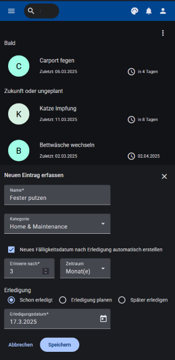
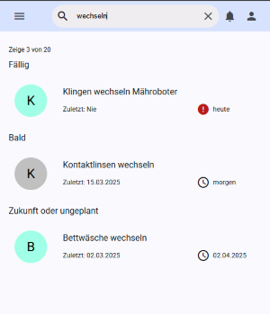

 

# RTRKR - modern and easy task manager

---

## About
This project is mainly intended as a personal practice project to try out new things (e.g. Angular Signals and NGRX Signal Store, Spring Modulith). Nevertheless, the project aims to be production-ready although I do not plan to deploy and run it. 
RTRKR (pronounced: retracker) was built around the idea of managing recurring tasks that require flexibility. Traditional calendar reminders often fall short for activities that don’t always happen on a strict schedule. For example, you might aim to get a haircut every four weeks, but if you delay it by a week, the next reminder should adapt accordingly. Regular calendar entries don’t accommodate these shifts, leading to reminders that feel out of sync. RTRKR addresses this by allowing reminders to be based on actual completion dates, ensuring that your schedule stays aligned with reality.

RTRKR is a responsive web application. It uses Java Spring Boot for the backend and Angular for the frontend.

## :sparkles: Key Features
* Task Logging: Users can log tasks and mark them as completed, with automatic recording of completion dates.
* Reminder Scheduling: Users can set recurrent reminders based on actual execution dates. Manual scheduling is also possible.
* Shared Lists: Manage lists together with your family, work group, or friends. Updates are automatically synchronized between users using websockets and stomp.
* Responsive Design: The application is designed to work seamlessly on various devices, providing an optimal user experience on desktops, tablets, and mobile phones.
* Light and Dark mode

## Screenshots

Desktop view in light theme with multiple lists

Mobile view in dark theme adding a new task.

Search feature

Real time synchronization of shared lists between users. 

## :electric_plug: Tech Stack

Backend: Java Spring Boot, Spring Modulith, Rest, WebSockets / Stomp, JPA / Spring Data

Infrastructure: Docker, KeyCloak, PostgreSQL

Frontend: Angular, Angular Material, NGRX Signal Store

